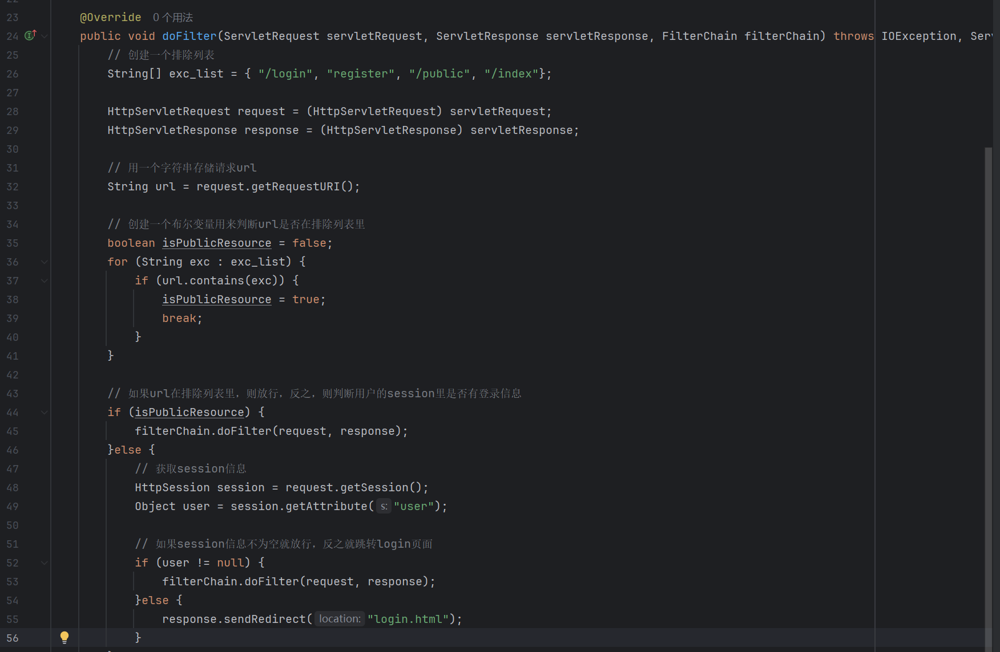
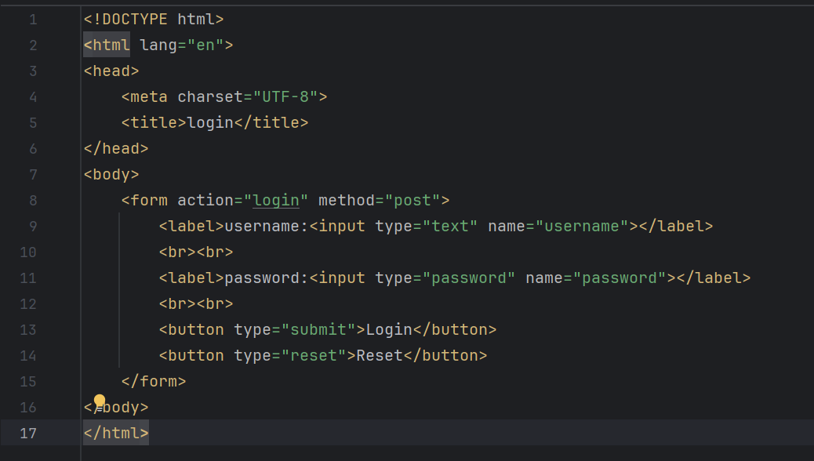
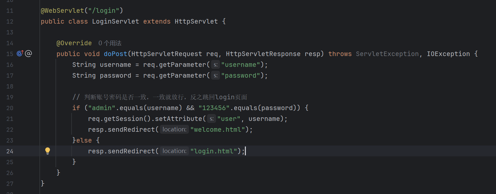

# 《Filter练习》

***

> **学院：省级示范性软件学院**
>
> **题目：《 Filter练习》**
>
> **姓名：刘顺文**
>
> **学号：2200770061**
>
> **班级：软工2202**
>
> **日期：2024-09-27**
>
> **实验环境： IDEA 2024.2.1**  **Tomcat**

***

## 题目及要求:

> **题目: 实现一个登录验证过滤器**
>
> **目标: 创建一个 Servlet的 过滤器,用于验证用户是否已登录。对于未登录的用户,将其重定向到登录页面。**
>
> **要求:** 
>
> 1. **创建一个名为 LoginFilter 的类, 实现 javax.servlet.Filter 接口。**
>
> 2. **使用 @WebFilter 注解配置过滤器,使其应用于所有 URL 路径 ("/*")。**
>
> 3. **在 doFilter 方法中实现以下逻辑:** 
>
>      **a. 检查当前请求是否是对登录页面、注册页面或公共资源的请求。如果是,则允许请求通过。** 
>      **b. 如果不是上述情况,检查用户的 session 中是否存在表示已登录的属性(如 "user" 属性)。**
>      **c. 如果用户已登录,允许请求继续。** 
>      **d. 如果用户未登录,将请求重定向到登录页面。**
>
> 4. **创建一个排除列表,包含不需要登录就能访问的路径(如 "/login", "/register", "/public")。**
>
> 5. **实现一个方法来检查当前请求路径是否在排除列表中。**
>
> 6. **添加适当的注释,解释代码的主要部分。**

***

## 实现：

> 1. 创建一个用来拦截访问请求的loginfilter,如果请求访问登录页面或者公共资源就放行,若请求其他页面,则判断session中是否有登录信息,有则放行,没有就跳转到login页面.
>
>    
>
>    
>
> 2. 编写login.html,里面设置input表单以及提交按钮,用来提交登录信息.
>
>    
>
>    
>
> 3. 创建loginservlet用来接收登录信息并设置session,在里面判断用户名密码是否正确,如果不正确就跳回login页面重新输入.
>
>    
>
>    
>
> 4. 最后经过loginfilter里验证session中的登录信息,成功跳转到welcome.html里.
>
>    