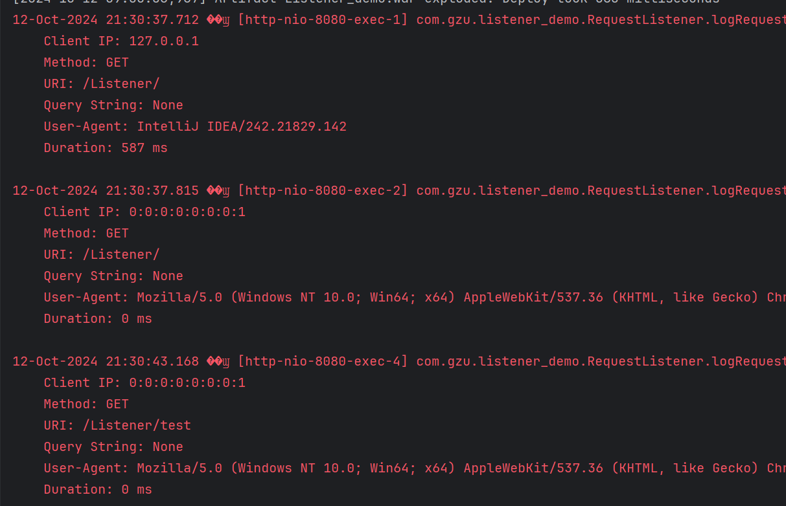

# 《Listener练习》

***

> **学院：省级示范性软件学院**
>
> **题目：《 Listener练习》**
>
> **姓名：刘顺文**
>
> **学号：2200770061**
>
> **班级：软工2202**
>
> **日期：2024-10-11**
>
> **实验环境： IDEA 2024.2.1**  **Tomcat**

***

## 一、题目及要求:

> 1. **实现一个 ServletRequestListener 来记录每个 HTTP 请求的详细信息。**
> 2. **记录的信息应包括但不限于：**
>
>      **请求时间**
>      **客户端 IP 地址**
>      **请求方法（GET, POST 等）**
>      **请求 URI**
>      **查询字符串（如果有）**
>      **User-Agent**
>      **请求处理时间（从请求开始到结束的时间）**
>
> 1. **在请求开始时记录开始时间，在请求结束时计算处理时间。**
> 2. **使用适当的日志格式，确保日志易于阅读和分析。**
> 3. **实现一个简单的测试 Servlet，用于验证日志记录功能。**
> 4. **提供简要说明，解释你的实现方式和任何需要注意的事项。**
>

***

## 二、实现

### 1、代码：

```java
package com.gzu.listener_demo;

import jakarta.servlet.ServletRequest;
import jakarta.servlet.ServletRequestEvent;
import jakarta.servlet.ServletRequestListener;
import jakarta.servlet.annotation.WebListener;
import jakarta.servlet.http.HttpServletRequest;

import java.text.SimpleDateFormat;
import java.util.Date;
import java.util.logging.Level;
import java.util.logging.Logger;

@WebListener("/*")
public class RequestListener implements ServletRequestListener {
    // 创建一个LOGGER实例来进行日志记录。
    private static final Logger LOGGER = Logger.getLogger(RequestListener.class.getName());
    private static final SimpleDateFormat DATE_FORMAT = new SimpleDateFormat("yyyy-MM-dd HH:mm:ss");

    // 在请求建立的时候记录开始时间。
    @Override
    public void requestInitialized(ServletRequestEvent sre) {
        sre.getServletRequest().setAttribute("startTime", System.currentTimeMillis());
    }

    // 在请求结束的时候记录结束时间，并用结束时间减去开始时间得到请求处理时间。
    @Override
    public void requestDestroyed(ServletRequestEvent sre) {
        long endTime = System.currentTimeMillis();
        long duration = endTime - (Long) sre.getServletRequest().getAttribute("startTime");
        logRequestDetails((HttpServletRequest) sre.getServletRequest(), endTime, duration);
    }

    // 创建一个ogRequestDetails方法用来获取用户IP、方法、URL、查询字符串、User-Agent、请求处理时间，并将这些信息存储进日志。
    private void logRequestDetails(HttpServletRequest request, long endTime, long duration) {
        StringBuilder logMessage = new StringBuilder();
        logMessage.append("[").append(DATE_FORMAT.format(new Date())).append("] ");
        logMessage.append("Request ended with details: \n");
        logMessage.append("\tClient IP: ").append(request.getRemoteAddr()).append("\n");
        logMessage.append("\tMethod: ").append(request.getMethod()).append("\n");
        logMessage.append("\tURI: ").append(request.getRequestURI()).append("\n");
        logMessage.append("\tQuery String: ").append(request.getQueryString() != null ? request.getQueryString() : "None").append("\n");
        logMessage.append("\tUser-Agent: ").append(request.getHeader("User-Agent")).append("\n");
        logMessage.append("\tDuration: ").append(duration).append(" ms\n");

        LOGGER.log(Level.INFO, logMessage.toString());
    }
}
```

### 2、Logger展示

